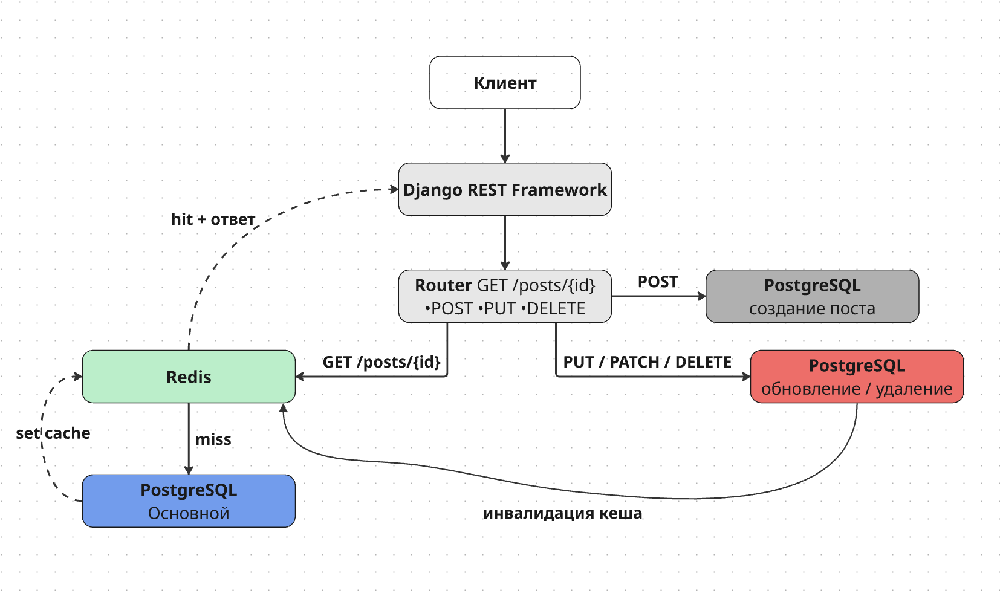

# Blog Cache API

REST API для блога с кешированием постов в Redis.

**Стек:** Python, Django, Django REST Framework, PostgreSQL, Redis

## Архитектура



**Почему такой подход к кешированию:**

- Cache-aside: данные попадают в Redis только при первом GET-запросе, а не при записи. Это исключает кеширование постов, которые никто не читает.
- TTL 300 секунд: достаточно для снижения нагрузки на бд, данные не устаревают, стандарт.
- Инвалидация при записи: при PUT/PATCH/DELETE кеш сбрасывается, следующий GET получит свежие данные из PostgreSQL.
- Ошибки Redis не роняют API - при недоступности кеша запросы идут напрямую в БД.
- Список постов не кешируется — он меняется при каждом POST/DELETE. Решил добавить пагинацию, ограничил выдачу до 10 постов на страницу.

## Пагинация

`GET /api/posts/` возвращает посты постранично по 10 штук:

```json
{
  "count": 42,
  "next": "http://localhost:8000/api/posts/?page=2",
  "previous": null,
  "results": [...]
}
```

Параметр запроса: `?page=2`

## Эндпоинты

| Метод  | URL                | Описание                    | Код ответа           |
|--------|--------------------|-----------------------------|----------------------|
| GET    | `/api/posts/`      | Список всех постов          | 200 OK               |
| POST   | `/api/posts/`      | Создать новый пост          | 201 Created / 400    |
| GET    | `/api/posts/{id}/` | Получить пост (с кешем)     | 200 OK / 404         |
| PUT    | `/api/posts/{id}/` | Обновить пост (все поля)    | 200 OK / 400 / 404   |
| PATCH  | `/api/posts/{id}/` | Обновить пост (часть полей) | 200 OK / 400 / 404   |
| DELETE | `/api/posts/{id}/` | Удалить пост                | 204 No Content / 404 |

## Установка и запуск

Два способа запуска: Docker или вручную.

---

### Вариант 1: Docker

#### 1. Клонировать репозиторий

```bash
git clone https://github.com/quack3rone/blog_api_B.git
cd blog_api_B
```

#### 2. Запустить

```bash
docker-compose up --build
```

#### Запуск тестов через Docker

```bash
docker-compose run --rm web pytest tests/
```

---

### Вариант 2: Локально

#### Требования

- Python
- PostgreSQL
- Redis

#### 1. Клонировать репозиторий

```bash
git clone https://github.com/quack3rone/blog_api_B.git
cd blog_api_B
```

#### 2. Создать виртуальное окружение и установить зависимости

```bash
python -m venv venv
source venv/bin/activate
pip install -r requirements.txt
```

#### 3. Настроить переменные

```bash
cp .env.example .env
```

Заполнить `.env` своими значениями

#### 4. Создать базу данных PostgreSQL

```bash
psql -U postgres -c "CREATE DATABASE blog_db;"
```

#### 5. Применить миграции

```bash
python manage.py migrate
```

#### 6. Запустить сервер

```bash
python manage.py runserver
```

#### Запуск тестов

```bash
pytest tests/
```

## Примеры запросов

Коллекция запросов для insomnia: `docs/insomnia.yaml`

### Создать пост

```bash
curl -X POST http://localhost:8000/api/posts/ \
  -H "Content-Type: application/json" \
  -d '{"title": "Первый пост", "content": "Содержание поста"}'
```

### Получить список постов

```bash
curl http://localhost:8000/api/posts/
```

### Получить пост

```bash
curl http://localhost:8000/api/posts/1/
```

### Обновить пост (все поля)

```bash
curl -X PUT http://localhost:8000/api/posts/1/ \
  -H "Content-Type: application/json" \
  -d '{"title": "Обновлённый заголовок", "content": "Новое содержание"}'
```

### Частичное обновление

```bash
curl -X PATCH http://localhost:8000/api/posts/1/ \
  -H "Content-Type: application/json" \
  -d '{"title": "Только заголовок"}'
```

### Удалить пост

```bash
curl -X DELETE http://localhost:8000/api/posts/1/
```
